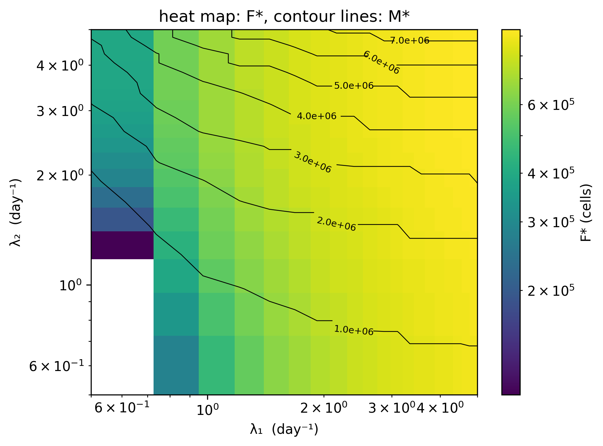

# Hot-Fibrosis Fixed-Point Scan  
_Extension of Adler et al. (2020) — Principles of Cell Circuits for Tissue Repair and Fibrosis_

This repository contains a **self-contained Python script**  
`lambda_scan_standalone.py`  
that sweeps two key parameters, λ₁ and λ₂: 

* **λ₁** – PDGF autocrine strength (fibroblast self-stimulation)  
* **λ₂** – CSF-1 mediated macrophage proliferation


and isolates the **hot-fibrosis** fixed point (highest fibroblast burden **F\***),
reporting the corresponding macrophage load **M\*** and exporting a publication-ready
heat-map:



---

## Model overview

The script implements the **full four-variable ODE system** from Adler et al. (2020), describing the interactions between:

- **M**: macrophages  
- **F**: myofibroblasts  
- **P**: PDGF (platelet-derived growth factor)  
- **C**: CSF (colony-stimulating factor)

The system is:

\[
\begin{aligned}
\frac{dF}{dt} &= \left( \lambda_1 \frac{P}{k_1 + P} \left(1 - \frac{F}{K}\right) - \mu_1 \right) F \\
\frac{dM}{dt} &= \left( \lambda_2 \frac{C}{k_2 + C} - \mu_2 \right) M \\
\frac{dP}{dt} &= \beta_2 M + \beta_3 F - \alpha_2 F \frac{P}{k_1 + P} - \gamma P \\
\frac{dC}{dt} &= \beta_1 F - \alpha_1 M \frac{C}{k_2 + C} - \gamma C
\end{aligned}
\]

### Term definitions

- **λ₁, λ₂**: Maximal proliferation rates of fibroblasts and macrophages  
- **μ₁, μ₂**: Apoptosis/removal rates  
- **β₁, β₂, β₃**: Secretion rates of CSF by fibroblasts, PDGF by macrophages, and PDGF by fibroblasts (autocrine)  
- **α₁, α₂**: Endocytosis rates for CSF and PDGF  
- **k₁, k₂**: Michaelis constants for PDGF and CSF uptake  
- **γ**: Ligand degradation rate  
- **K**: Carrying capacity for fibroblasts

This model describes a **multistable system** with three potential fixed points:  
- **Healing** (low M, low F)  
- **Cold fibrosis** (high F, zero M)  
- **Hot fibrosis** (high M and F)

These correspond to physiological fates observed in tissue injury and repair.

---

## Biological context

As discussed in *Adler et al. (2020)*, persistent inflammation can tip tissue repair into a fibrotic state. The model captures this behavior as a **dynamical bistability**, governed by feedback loops and growth factor interactions. The PDGF autocrine loop and mutual M–F stimulation are central to the emergence of fibrosis.

---

## Numerical pipeline

The script scans across ranges of **λ₁** and **λ₂**, and for each pair:

1. **Identifies candidate fixed points** using a fast method based on detecting sign changes in the reduced 2D system:
   \[
   \phi_F(F,M) = 0, \quad \phi_M(F,M) = 0
   \]
   where **P** and **C** are set via quasi-steady-state approximations (QSSA):
   \[
   P = P_\text{qss}(F,M), \quad C = C_\text{qss}(F,M)
   \]

2. **Refines these seeds** via Newton-Raphson (`newton_polish`) on the full four-variable system.

3. **Sorts and classifies** up to three fixed points by fibroblast level F:
   - Healing (lowest F\*)
   - Cold fibrosis (high F, zero M)
   - Hot fibrosis (highest F and M)

4. **Exports** the hot-fibrosis values **(F\*, M\*)** as a CSV table and optionally generates a heatmap.

---

## Quick start

```bash
git clone git@github.com:Tom-Brenner/hot-fibrosis-scan.git
cd hot-fibrosis-scan
python3 -m venv .venv && source .venv/bin/activate
pip install -r requirements.txt      # numpy scipy matplotlib

python lambda_scan_standalone.py \
       --lambda1_lo 0.2  --lambda1_hi 2 \
       --lambda2_lo 0.2  --lambda2_hi 2 \
       --N 30 --nproc 8  

```
---

## Referenced work

    Adler, Y. et al. “Principles of Cell Circuits for Tissue Repair and Fibrosis”
    iScience 23, 2 (2020) 100841.
    https://doi.org/10.1016/j.isci.2020.100841
